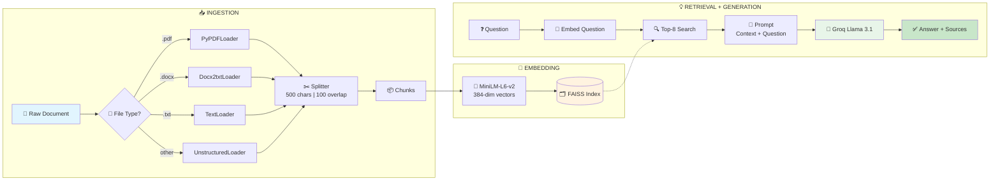
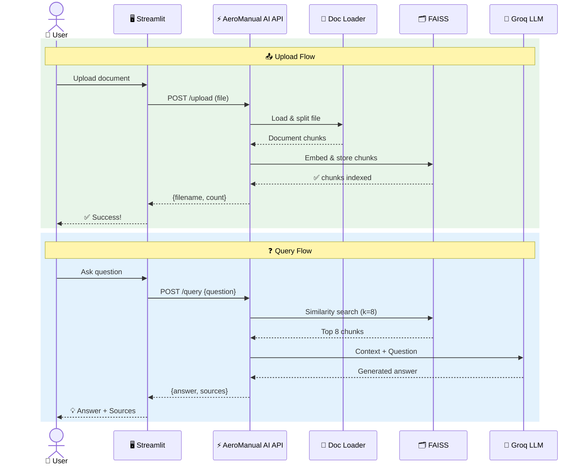

# ✈️ AeroManual AI

An intelligent document Q&A application powered by Retrieval-Augmented Generation (RAG). Upload training manuals, technical documents (PDF, DOCX, TXT, etc.), and ask questions — AeroManual AI retrieves relevant context and generates accurate answers using Groq's Llama 3.1 model.

---

## 📐 High-Level Architecture

```
 ┌──────────┐       ┌───────────────┐       ┌──────────────────┐
 │          │       │               │       │                  │
 │  👤 User │──────▶│  🖥️ Streamlit │──────▶│  ⚡ FastAPI       │
 │          │       │     UI        │       │   Backend        │
 └──────────┘       └───────────────┘       └────────┬─────────┘
                                                     │
                            ┌────────────────────────┼────────────────────────┐
                            │                        │                        │
                            ▼                        ▼                        ▼
                    ┌───────────────┐      ┌─────────────────┐     ┌──────────────────┐
                    │ 📄 Document   │      │ 🗂️ FAISS Vector │     │ 🤖 Groq LLM      │
                    │    Loader     │      │     Store       │     │  Llama 3.1 8B    │
                    │               │      │                 │     │                  │
                    │ PDF/DOCX/TXT  │─────▶│  Embeddings +   │────▶│  Context-Aware   │
                    │ → Chunks      │      │  Similarity     │     │  Answer Gen      │
                    └───────────────┘      └─────────────────┘     └──────────────────┘
```

---

## 🔄 How It Works — The Two Main Flows

### 📤 Flow 1: Document Upload & Indexing

```
  📎 Upload File                    💾 Save                      📖 Load & Parse
 ┌────────────┐              ┌────────────────┐              ┌────────────────────┐
 │            │              │                │              │                    │
 │  User      │    ──────▶   │  uploads/      │    ──────▶   │  Detect File Type  │
 │  selects   │   POST       │  directory     │              │  PDF → PyPDFLoader │
 │  file      │   /upload    │                │              │  DOCX → Docx2txt   │
 │            │              │                │              │  TXT → TextLoader  │
 └────────────┘              └────────────────┘              └─────────┬──────────┘
                                                                      │
                                                                      ▼
  ✅ Done!                     🗂️ Store                       ✂️ Split into Chunks
 ┌────────────┐              ┌────────────────┐              ┌────────────────────┐
 │            │              │                │              │                    │
 │  Response: │    ◀──────   │  FAISS Index   │    ◀──────   │  500 chars/chunk   │
 │  filename  │              │  saved to disk │              │  100 char overlap  │
 │  + count   │              │  vectorstore/  │              │                    │
 │            │              │                │              │  → Embed with      │
 └────────────┘              └────────────────┘              │  MiniLM-L6-v2      │
                                                             └────────────────────┘
```

### ❓ Flow 2: Question Answering

```
  💬 Ask Question                🔍 Embed & Search              📚 Get Context
 ┌────────────┐              ┌────────────────┐              ┌────────────────────┐
 │            │              │                │              │                    │
 │  User      │    ──────▶   │  Convert to    │    ──────▶   │  FAISS returns     │
 │  types     │   POST       │  384-dim       │   similarity │  Top 8 most        │
 │  question  │   /query     │  vector        │   search     │  relevant chunks   │
 │            │              │                │              │                    │
 └────────────┘              └────────────────┘              └─────────┬──────────┘
                                                                      │
                                                                      ▼
  💡 Display Answer              🤖 Generate                   📝 Build Prompt
 ┌────────────┐              ┌────────────────┐              ┌────────────────────┐
 │            │              │                │              │                    │
 │  Answer +  │    ◀──────   │  Groq LLM      │    ◀──────   │  Context:          │
 │  Source    │              │  Llama 3.1 8B  │              │  [8 chunks]        │
 │  files     │              │  temp = 0.3    │              │                    │
 │  shown     │              │                │              │  Question:         │
 └────────────┘              └────────────────┘              │  [user question]   │
                                                             └────────────────────┘
```

---

## 🧩 RAG Pipeline — Under the Hood



---

## 🔀 Sequence Diagram — Full Interaction



---

## 🏗️ Project Structure

```
AeroManual-AI/
│
├── 📂 app/
│   ├── __init__.py .............. Package init
│   ├── config.py ................ Settings & parameters
│   ├── document_loader.py ....... Load & split documents
│   ├── vector_store.py .......... FAISS index operations
│   ├── rag_chain.py ............. RAG chain (retrieval + LLM)
│   └── api.py ................... FastAPI endpoints
│
├── 📂 uploads/ .................. Uploaded documents
├── 📂 vectorstore/ .............. Persisted FAISS index
│
├── ui.py ........................ Streamlit chat UI
├── requirements.txt ............. Python dependencies
└── README.md .................... This file
```

---

## 🔧 Configuration

| Parameter | Value | Description |
|---|---|---|
| 🤖 `GROQ_MODEL` | `llama-3.1-8b-instant` | LLM for answer generation |
| 🧠 `EMBEDDING_MODEL` | `all-MiniLM-L6-v2` | Embedding model (384-dim) |
| ✂️ `CHUNK_SIZE` | `500` | Characters per text chunk |
| 🔗 `CHUNK_OVERLAP` | `100` | Overlap between chunks |
| 🔍 `TOP_K` | `8` | Chunks retrieved per query |

---

## 🌐 API Endpoints

| Method | Endpoint | Input | Output |
|---|---|---|---|
| `POST` | `/upload` | File (multipart) | `{filename, chunks_indexed}` |
| `POST` | `/query` | `{question: string}` | `{answer, sources}` |
| `GET` | `/health` | — | `{status: "ok"}` |

---

## ⚙️ Setup & Installation

### Prerequisites
- Python 3.10+
- Groq API key (free at [console.groq.com](https://console.groq.com))

### 1. Install Dependencies
```bash
cd AeroManual-AI
pip install -r requirements.txt
```

### 2. Configure Environment
Ensure the `.env` file in the AIML root directory contains:
```env
GROQ_API_KEY=<your_groq_api_key>
```

### 3. Run the Application

**Terminal 1 — API server:**
```bash
cd AeroManual-AI
set NO_PROXY=localhost,127.0.0.1
uvicorn app.api:app --reload --host 127.0.0.1 --port 8000
```

**Terminal 2 — Streamlit UI:**
```bash
cd AeroManual-AI
set NO_PROXY=localhost,127.0.0.1
streamlit run ui.py
```

> ⚠️ The `NO_PROXY` and `--host 127.0.0.1` flags are required on corporate networks to bypass proxy interception of localhost traffic.

### 4. Open the App
Navigate to **http://localhost:8501** in your browser.

---

## 🛠️ Troubleshooting

### ❌ `ConnectionError: [WinError 10061] No connection could be made`

```
  ┌─────────────────────────────────────────────────────────────────────────┐
  │                     🔍 Diagnosis Flowchart                             │
  └────────────────────────────────┬────────────────────────────────────────┘
                                   │
                                   ▼
                    ┌──────────────────────────────┐
                    │  Is the FastAPI server        │
                    │  actually running?            │
                    └──────────┬───────────┬────────┘
                               │           │
                          YES  │           │  NO
                               ▼           ▼
              ┌─────────────────┐   ┌──────────────────────────────┐
              │ Check for proxy  │   │ Run this to find the error:  │
              │ interference     │   │                              │
              │ (see below)      │   │ python -c                    │
              └─────────────────┘   │   "from app.api import app"  │
                                    └──────────────┬───────────────┘
                                                   │
                              ┌─────────────────────┼──────────────────────┐
                              │                     │                      │
                              ▼                     ▼                      ▼
                  ┌──────────────────┐  ┌──────────────────┐  ┌──────────────────┐
                  │ ModuleNotFound:  │  │ ModuleNotFound:  │  │ Other import     │
                  │ langchain.       │  │ langchain.       │  │ error?           │
                  │ text_splitter    │  │ prompts          │  │                  │
                  │                  │  │                  │  │ pip install -r   │
                  │ ✅ Fix:          │  │ ✅ Fix:          │  │ requirements.txt │
                  │ Use import from  │  │ Use import from  │  │                  │
                  │ langchain_text_  │  │ langchain_core.  │  │                  │
                  │ splitters        │  │ prompts          │  │                  │
                  └──────────────────┘  └──────────────────┘  └──────────────────┘
```

#### 🔧 Known Fixes (LangChain ≥ 1.x)

LangChain 1.x moved several modules. If you see import errors, apply these fixes:

| File | Old Import (broken) | Fixed Import |
|---|---|---|
| `app/document_loader.py` | `from langchain.text_splitter import ...` | `from langchain_text_splitters import RecursiveCharacterTextSplitter` |
| `app/rag_chain.py` | `from langchain.prompts import ...` | `from langchain_core.prompts import ChatPromptTemplate` |

#### 🌐 Corporate Proxy Blocking Localhost

If your machine uses a corporate proxy (e.g., McAfee Web Gateway), it may intercept `localhost` requests.

```
  ┌────────────┐         ┌──────────────┐         ┌────────────┐
  │ Streamlit  │──────▶  │ 🛡️ Corporate │──╳──▶   │  FastAPI   │
  │ UI :8501   │         │    Proxy     │  BLOCKED │  :8000     │
  └────────────┘         └──────────────┘         └────────────┘

  ✅ Fix: Bypass the proxy for local addresses

  ┌────────────┐                                  ┌────────────┐
  │ Streamlit  │──────────── DIRECT ─────────────▶│  FastAPI   │
  │ UI :8501   │   (NO_PROXY=localhost,127.0.0.1) │  :8000     │
  └────────────┘                                  └────────────┘
```

**Steps:**
1. Set `NO_PROXY` env var before starting both servers:
   ```bash
   set NO_PROXY=localhost,127.0.0.1
   ```
2. Bind uvicorn to `127.0.0.1` explicitly:
   ```bash
   uvicorn app.api:app --reload --host 127.0.0.1 --port 8000
   ```
3. Ensure `ui.py` uses `http://127.0.0.1:8000` as the API URL (not `localhost`)

---

## 🚀 Quick Start Guide

```
  ┌─────────────┐     ┌─────────────┐     ┌─────────────┐     ┌─────────────┐     ┌─────────────┐
  │             │     │             │     │             │     │             │     │             │
  │  1️⃣ Open    │────▶│  2️⃣ Upload  │────▶│  3️⃣ Process │────▶│  4️⃣ Ask     │────▶│  5️⃣ Get     │
  │  App        │     │  Docs       │     │  & Index    │     │  Questions  │     │  Answers!   │
  │  :8501      │     │  (sidebar)  │     │  (click)    │     │  (chat)     │     │  + Sources  │
  │             │     │             │     │             │     │             │     │             │
  └─────────────┘     └─────────────┘     └─────────────┘     └─────────────┘     └─────────────┘
```
