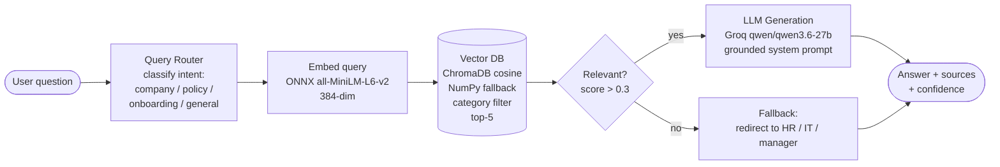
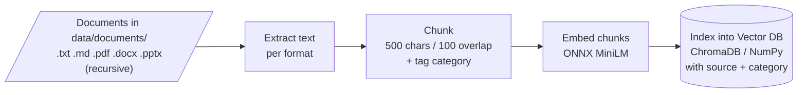

# AI Training Assistant for New Employees

An AI-powered onboarding assistant that answers employee questions by routing queries to appropriate knowledge sources and generating context-aware responses using RAG (Retrieval-Augmented Generation).

## Architecture

### Live Query Flow



### Offline Ingestion (one-time, on first run)



> Note: Mermaid diagrams render automatically on GitHub, GitLab, and in VS Code
> with a Mermaid preview extension. In plain-text viewers they appear as fenced
> code blocks.

## Features

- **Login & Roles**: Sign-in required to use the app; `employee` (chat) and `admin` (chat + observability portal) roles. Local bcrypt auth as a demo-safe stand-in for enterprise SSO — see `PRODUCTION.md`
- **Per-user Sessions**: Each logged-in user gets an isolated assistant and conversation history
- **Rate Limiting**: Per-user sliding-window request limit
- **Admin Portal**: Admin-only observability dashboard with charts (latency-over-time, routing, confidence, filter scope, feedback) and downloadable CSV reports
- **Document Management**: Admins upload documents and rebuild the knowledge base from the portal — no redeploy; new docs are indexed immediately for all users
- **Answer Feedback**: 👍 / 👎 on any answer feeds a satisfaction metric and the admin feedback chart
- **Audit Logging**: Every query, feedback event, and upload is attributed to its user in the event log
- **Query Routing**: Classifies questions into categories (company, policy, onboarding, general)
- **RAG Pipeline**: Retrieves relevant document chunks using semantic search (cosine similarity)
- **Vector Database**: ChromaDB persistent local vector DB (default), with a NumPy fallback selectable via `VECTOR_BACKEND`
- **Category-Filtered Retrieval**: Each chunk is tagged with its routing category; retrieval is scoped to the routed category (via ChromaDB's native metadata filter / NumPy mask), with an automatic unfiltered retry when a scoped search finds nothing relevant
- **Groq LLM**: Fast inference with `qwen/qwen3.6-27b` (free tier)
- **Lightweight Embeddings**: ONNX Runtime + all-MiniLM-L6-v2 (no PyTorch needed)
- **Conversation Memory**: Maintains context across multi-turn conversations
- **Confidence Scoring**: Reports retrieval confidence with each answer
- **Source Attribution**: Shows which documents informed the answer
- **Gradio UI**: Interactive web-based chat interface (Gradio 6.x), with per-answer badges for category, confidence, and vector-DB filter scope (`🔎 filter: <category>` / `🌐 filter: all` / `🔁 retry: unfiltered`)
- **Observability**: Structured tracing, JSONL event logs, and live runtime metrics (latency, tokens, routing, confidence, error/fallback rates)

## Setup

```bash
cd "BIA/Capstone Project/ai-training-assistant"

# Create virtual environment (Python 3.12 recommended)
py -3.12 -m venv .venv
.venv\Scripts\activate  # Windows
# source .venv/bin/activate  # macOS/Linux

# Install dependencies (lightweight, no PyTorch or C++ build tools needed)
pip install -r requirements.txt

# If behind a corporate proxy, bypass it:
# pip install -r requirements.txt --index-url https://pypi.org/simple/ --trusted-host pypi.org --trusted-host files.pythonhosted.org

# Configure API key
copy .env.sample .env
# Edit .env and add your Groq API key from https://console.groq.com
```

## Login, Roles & Admin Portal

Sign-in is required to use the app. Two roles are supported:

| Role | Access |
|------|--------|
| `employee` | The chat assistant only |
| `admin` | Chat **plus** the 📊 Admin Portal (observability charts + CSV reports) |

Credentials are seeded into `data/users.json` (gitignored, bcrypt-hashed) on
first run from these `.env` values — **change them before any shared use**:

```
ADMIN_USERNAME=admin
ADMIN_PASSWORD=change-me-admin
EMPLOYEE_USERNAME=employee
EMPLOYEE_PASSWORD=change-me-employee
RATE_LIMIT_MAX_REQUESTS=30
RATE_LIMIT_WINDOW_SECONDS=60
```

To reset credentials, edit `.env` and delete `data/users.json` (it reseeds on
next launch).

### Admin Portal

Sign in as the admin user and open the **📊 Admin Portal** tab (hidden/locked
for non-admins). It shows:

- **Charts**: query latency over time, routing-category distribution,
  confidence distribution, vector-DB filter scope, and user feedback.
- **Live metrics**: latency (p50/p95), tokens, routes, confidence,
  error/fallback rates, category-filter usage, and feedback satisfaction rate.
- **Reports**: one-click CSV export of the per-query report and the aggregated
  metrics summary (written to `data/logs/reports/`).
- **Document Management**: upload `.txt/.md/.pdf/.docx/.pptx` files and click
  **Upload & rebuild index** to ingest them immediately — no restart. Uploaded
  files are stored under `data/documents/uploads/` and indexed for all users.

Employees can rate any answer with 👍 / 👎 in the chat; this feeds the
satisfaction metric and the feedback chart in the admin portal.

> This local login/roles model is a demo-safe stand-in for enterprise SSO.
> See `PRODUCTION.md` for the full MNC production checklist (SSO, secrets vault,
> scalable vector DB, horizontal scaling, alerting, compliance, etc.).

## Vector Database Backend

The assistant stores document embeddings in a swappable vector-store backend,
selected with the `VECTOR_BACKEND` environment variable in `.env`:

| `VECTOR_BACKEND` | Backend | Notes |
|------------------|---------|-------|
| `chroma` (default) | **ChromaDB** | Real local vector database; persists to `data/chroma_store/` and reloads across runs |
| `numpy` | NumPy | Legacy in-memory cosine search; persists to `data/vector_store/` |

Both backends use the same local ONNX `all-MiniLM-L6-v2` embeddings and produce
identical retrieval results, so you can switch freely. To rebuild the index
after changing documents or backends, delete the matching store folder
(`data/chroma_store/` or `data/vector_store/`) and restart the app.

```bash
# Switch backend (Windows PowerShell example)
$env:VECTOR_BACKEND = "chroma"   # or "numpy"
python app.py
```

## Supported Document Formats

The assistant can ingest and search across multiple document formats:

| Format | Extension | What's Extracted |
|--------|-----------|-----------------|
| Text | `.txt` | Full text content |
| Markdown | `.md` | Full text content |
| PDF | `.pdf` | Text from all pages |
| Word | `.docx` | Paragraphs + table content |
| PowerPoint | `.pptx` | Text from all slides + tables |

Documents may be organized in nested subfolders — the loader searches
`data/documents/` recursively, and uses each file's relative path as its
source label (e.g. `corpus/policies/leave_policy.md`).

### Adding New Documents

1. Place any `.txt`, `.md`, `.pdf`, `.docx`, or `.pptx` file into
   `data/documents/` (subfolders are allowed)
2. Delete the `data/vector_store/` folder (forces rebuild)
3. Restart the app (`python app.py`)

The app will auto-detect, extract text, chunk, embed, and index all documents on startup.

## Run

```bash
# Activate the virtual environment first (dependencies live here)
.venv\Scripts\activate        # Windows
# source .venv/bin/activate   # macOS/Linux

python app.py
```

Open http://localhost:7860 in your browser. The app runs locally only
(no public share link).

On first run, the embedding model (~90MB ONNX file) will be downloaded from HuggingFace and cached locally.

## Project Structure

```
ai-training-assistant/
├── app.py                  # Gradio web interface
├── requirements.txt        # Python dependencies
├── .env.sample             # API key + auth/rate-limit template
├── README.md               # This file
├── PRODUCTION.md           # MNC production-readiness checklist
├── data/
│   ├── documents/          # Source documents for RAG
│   │   └── corpus/         # Company docs (.md) grouped by source
│   │       ├── company/    #   company_overview.md
│   │       ├── roles/      #   data_analyst_role.md, product_manager_role.md
│   │       ├── policies/   #   expense, leave, code_of_conduct, security
│   │       ├── admin/      #   hr_processes, it_tools_access, onboarding, ...
│   │       └── faq/        #   onboarding_faq.md
│   ├── chroma_store/       # ChromaDB vector database (auto-generated, default)
│   ├── vector_store/       # NumPy vector store (auto-generated, fallback)
│   ├── users.json          # Local auth user store (auto-seeded, gitignored)
│   ├── logs/               # Event log + reports/ CSV exports (auto-generated)
│   └── model/              # ONNX embedding model (auto-downloaded)
└── src/
    ├── __init__.py
    ├── auth.py             # Login, roles, password hashing, rate limiting
    ├── knowledge_base.py   # Document loading, chunking, ONNX embedding, ChromaDB/NumPy retrieval
    ├── router.py           # Query classification logic
    ├── observability.py    # Structured logging, tracing, metrics, CSV reports
    └── assistant.py        # Main orchestrator (RAG + rou http://localhost:7860,ting + generation)
```

Runtime observability logs are written to `data/logs/events.jsonl`
(auto-generated, gitignored).

## How It Works

1. **Document Ingestion**: On first run, recursively loads all supported documents (`.txt`, `.md`, `.pdf`, `.docx`, `.pptx`) from `data/documents/` and its subfolders, chunks them (500 chars, 100 overlap), embeds with all-MiniLM-L6-v2 via ONNX Runtime, and indexes them into the vector database (ChromaDB by default, NumPy fallback via `VECTOR_BACKEND`).
2. **Query Routing**: Each question is classified by the LLM into a category (company/policy/onboarding/general).
3. **Retrieval**: The question is embedded and top-5 similar chunks are fetched via cosine similarity. When the routed category maps to a real document category (company/policy/onboarding), the search is scoped to that category using the vector DB's metadata filter; if a scoped search finds no relevant chunk, it automatically retries unfiltered so recall is preserved.
4. **Generation**: Retrieved context + question sent to Groq LLM (`qwen/qwen3.6-27b`) with a system prompt enforcing grounded answers.
5. **Response**: Answer returned with source attribution and confidence score.

## Evaluation

The project ships a labeled evaluation set (`OneDrive_1_8-22-2026/evaluation_set.csv`,
20 questions with gold source citations and expected key phrases) and an
evaluation script.

```bash
# Retrieval-only metrics (no API key needed)
python evaluate.py

# Full evaluation, including generated answers + refusal checks (needs GROQ_API_KEY)
python evaluate.py --with-llm
```

Measured on the bundled `corpus/` dataset:

| Metric | Result |
|--------|--------|
| Citation accuracy (gold source in top-5) | 16/17 = **94%** |
| Key-phrase present in retrieved context | 17/17 = **100%** |
| Refusal correctness (sensitive/out-of-scope questions) | 2/3 = **67%** |

**How to read these metrics:**

- **Citation accuracy (94%)** — of the 17 answerable questions, the *exact
  gold-labeled source file* appeared in the top-5 for 16. The one miss (Q03,
  "common internal tools") is a keyword overlap: "Common Tools" is a heading in
  `it_tools_access.md`, so the retriever surfaced that instead of the expected
  `company_overview.md`. It is an attribution miss, not a wrong answer.
- **Key-phrase recall (100%)** — for *every* answerable question the correct
  fact was present in the retrieved context. This is the key grounding signal:
  the right information was always in front of the LLM, so it never had to
  invent an answer (even on Q03).
- **Refusal correctness (67% = 2/3)** — the 3 `direct_llm` cases should be
  refused. Q18 (salary breakup) and Q19 (approve my leave) were correctly
  refused/redirected. Q20 (write a performance improvement plan) was answered
  instead of asking a clarifying question first — a soft edge case and a known
  improvement target, not a safety failure.

> Note: the generated-answer key-phrase score is lower than retrieval recall
> because the LLM paraphrases (e.g. "within ten days" vs the gold "within 10
> days"); the retrieved context still contains the correct facts 100% of the
> time.

## Observability

The assistant is instrumented end-to-end so you can see what happens on every
query — useful for debugging, cost tracking, and demoing production readiness.
It is built entirely on the Python standard library (no APM/OTEL dependency),
keeping the install lightweight.

**What's tracked (per request, correlated by a `trace_id`):**

- **Spans + latency**: `routing`, `embedding`, `retrieval`, `generation`, and
  the overall `query` span are timed. Aggregated latency reports include
  avg / p50 / p95 / max per span.
- **Token usage**: prompt and completion tokens from the Groq API response,
  for cost and throughput visibility.
- **Retrieval quality**: top similarity score per query (avg / min / max).
- **Routing + confidence**: distribution of routed categories and confidence
  labels.
- **Reliability**: error count/rate (by exception type) and fallback rate
  (queries with no sufficiently relevant context).
- **Category filtering**: how often retrieval was scoped to a routing category
  (category-filter rate + per-scope breakdown) and how often a scoped search
  found nothing and was retried unfiltered (unfiltered-retry rate).

**Where it goes:**

- **Console**: human-readable log lines during a run.
- **`data/logs/events.jsonl`**: one structured JSON event per line (span,
  status, duration, trace_id, and metadata) — easy to `grep`, load into pandas,
  or ship to a backend (OpenTelemetry / Prometheus / Loki) later.
- **Live metrics panel**: the Gradio UI has a collapsible *"📊 Observability —
  live metrics"* accordion with a refresh button showing the current snapshot.

The metrics collector (`src/observability.py`) is thread-safe and exposes a
`snapshot()` dict, so it can also be scraped programmatically or wired to a
`/metrics` endpoint.

## Tech Stack

| Component | Technology | Why |
|-----------|-----------|-----|
| LLM | Groq (`qwen/qwen3.6-27b`) | Fast, free-tier inference |
| Observability | Python stdlib `logging` + JSONL | Zero-dependency tracing & metrics |
| Embeddings | ONNX Runtime + all-MiniLM-L6-v2 | Lightweight, no PyTorch dependency |
| Vector Database | ChromaDB (persistent, cosine) | Real local vector DB; persists across runs |
| Vector Store (fallback) | NumPy (cosine similarity) | Pure-Python legacy backend, no extra deps |
| UI | Gradio 6.x | Simple, interactive chat interface |
| Tokenizer | HuggingFace `tokenizers` | Fast Rust-based tokenization |

## Example Questions

These match the bundled `corpus/` dataset and the app's built-in examples
(drawn from the labeled evaluation set, covering all four routing categories):

- "What are standard work hours and the core collaboration window?" *(general)*
- "As a Data Analyst, what are the first 30 days expectations?" *(role-specific)*
- "How do I submit an expense claim and by when?" *(admin/policy)*
- "How do I request PTO and what notice is expected for planned leave?" *(admin/policy)*
- "What should I do if I can't access a tool on Day 1?" *(admin/policy)*
- "What are the steps to take if I suspect a security incident?" *(admin/policy)*
- "What is my exact salary breakup and tax deductions?" *(refusal — redirects to HR)*
- "Can you approve my leave request right now?" *(refusal — no action authority)*

## Cost

- **Embedding**: Free (ONNX model runs locally)
- **Vector Database**: Free (ChromaDB / NumPy, runs locally)
- **LLM**: Free tier on Groq
- **Total**: $0 for development and demo
