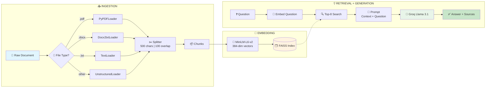
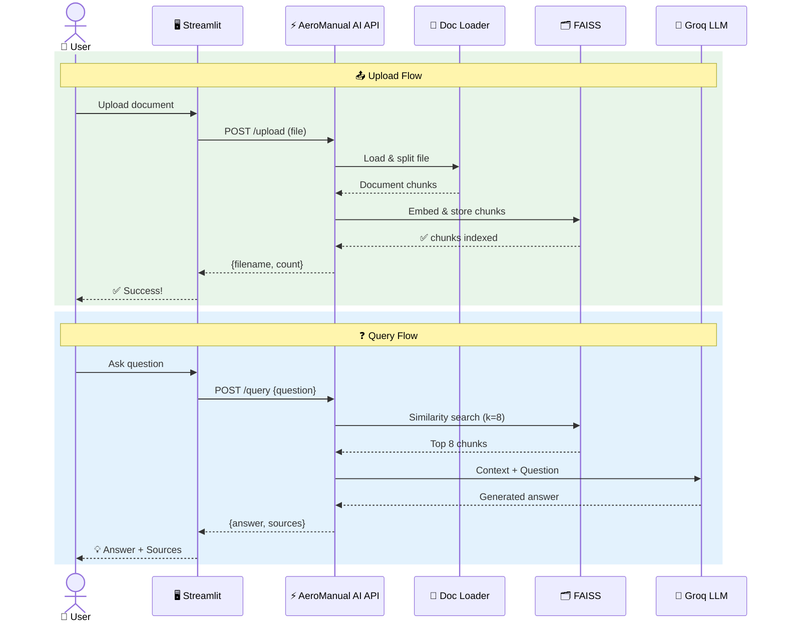

# ✈️ AeroManual AI

An intelligent document Q&A application powered by Retrieval-Augmented Generation (RAG). Upload training manuals, technical documents (PDF, DOCX, TXT, etc.), and ask questions — AeroManual AI retrieves relevant context and generates accurate answers using Groq's Llama 3.1 model.

---

## 📐 High-Level Architecture

```
 ┌──────────┐       ┌───────────────┐       ┌──────────────────┐
 │          │       │               │       │                  │
 │  👤 User │──────▶│  🖥️ Streamlit │──────▶│  ⚡ FastAPI       │
 │          │       │     UI        │       │   Backend        │
 └──────────┘       └───────────────┘       └────────┬─────────┘
                                                     │
                            ┌────────────────────────┼────────────────────────┐
                            │                        │                        │
                            ▼                        ▼                        ▼
                    ┌───────────────┐      ┌─────────────────┐     ┌──────────────────┐
                    │ 📄 Document   │      │ 🗂️ FAISS Vector │     │ 🤖 Groq LLM      │
                    │    Loader     │      │     Store       │     │  Llama 3.1 8B    │
                    │               │      │                 │     │                  │
                    │ PDF/DOCX/TXT  │─────▶│  Embeddings +   │────▶│  Context-Aware   │
                    │ → Chunks      │      │  Similarity     │     │  Answer Gen      │
                    └───────────────┘      └─────────────────┘     └──────────────────┘
```

---

## 🔄 How It Works — The Two Main Flows

### 📤 Flow 1: Document Upload & Indexing

```
  📎 Upload File                    💾 Save                      📖 Load & Parse
 ┌────────────┐              ┌────────────────┐              ┌────────────────────┐
 │            │              │                │              │                    │
 │  User      │    ──────▶   │  uploads/      │    ──────▶   │  Detect File Type  │
 │  selects   │   POST       │  directory     │              │  PDF → PyPDFLoader │
 │  file      │   /upload    │                │              │  DOCX → Docx2txt   │
 │            │              │                │              │  TXT → TextLoader  │
 └────────────┘              └────────────────┘              └─────────┬──────────┘
                                                                      │
                                                                      ▼
  ✅ Done!                     🗂️ Store                       ✂️ Split into Chunks
 ┌────────────┐              ┌────────────────┐              ┌────────────────────┐
 │            │              │                │              │                    │
 │  Response: │    ◀──────   │  FAISS Index   │    ◀──────   │  500 chars/chunk   │
 │  filename  │              │  saved to disk │              │  100 char overlap  │
 │  + count   │              │  vectorstore/  │              │                    │
 │            │              │                │              │  → Embed with      │
 └────────────┘              └────────────────┘              │  MiniLM-L6-v2      │
                                                             └────────────────────┘
```

### ❓ Flow 2: Question Answering

```
  💬 Ask Question                🔍 Embed & Search              📚 Get Context
 ┌────────────┐              ┌────────────────┐              ┌────────────────────┐
 │            │              │                │              │                    │
 │  User      │    ──────▶   │  Convert to    │    ──────▶   │  FAISS returns     │
 │  types     │   POST       │  384-dim       │   similarity │  Top 8 most        │
 │  question  │   /query     │  vector        │   search     │  relevant chunks   │
 │            │              │                │              │                    │
 └────────────┘              └────────────────┘              └─────────┬──────────┘
                                                                      │
                                                                      ▼
  💡 Display Answer              🤖 Generate                   📝 Build Prompt
 ┌────────────┐              ┌────────────────┐              ┌────────────────────┐
 │            │              │                │              │                    │
 │  Answer +  │    ◀──────   │  Groq LLM      │    ◀──────   │  Context:          │
 │  Source    │              │  Llama 3.1 8B  │              │  [8 chunks]        │
 │  files     │              │  temp = 0.3    │              │                    │
 │  shown     │              │                │              │  Question:         │
 └────────────┘              └────────────────┘              │  [user question]   │
                                                             └────────────────────┘
```

---

## 🧩 RAG Pipeline — Under the Hood



---

## 🔀 Sequence Diagram — Full Interaction



---

## 🏗️ Project Structure

```
Projects/AeroManual-AI/
│
├── 📂 app/
│   ├── __init__.py .............. Package init
│   ├── config.py ................ Settings & parameters
│   ├── document_loader.py ....... Load & split documents
│   ├── vector_store.py .......... FAISS index operations
│   ├── rag_chain.py ............. RAG chain (retrieval + LLM)
│   └── api.py ................... FastAPI endpoints + Prometheus metrics
│
├── 📂 k8s/
│   ├── namespace.yml ............ Kubernetes namespace
│   ├── secret.yml ............... GROQ_API_KEY secret
│   ├── pvc.yml .................. Persistent volume claims
│   ├── api-deployment.yml ....... API deployment & service
│   ├── ui-deployment.yml ........ UI deployment & service
│   └── monitoring.yml ........... Prometheus + Grafana stack
│
├── 📂 monitoring/
│   ├── prometheus.yml ........... Prometheus scrape config
│   └── grafana-datasource.yml ... Grafana datasource provisioning
│
├── 📂 uploads/ .................. Uploaded documents
├── 📂 vectorstore/ .............. Persisted FAISS index
│
├── Dockerfile ................... Container image (API + UI)
├── docker-compose.yml ........... Local multi-container setup
├── entrypoint.sh ................ Container entrypoint script
├── .dockerignore ................ Docker build exclusions
├── ui.py ........................ Streamlit chat UI
├── requirements.txt ............. Python dependencies
└── README.md .................... This file
```

---

## 🔧 Configuration

| Parameter | Value | Description |
|---|---|---|
| 🤖 `GROQ_MODEL` | `llama-3.1-8b-instant` | LLM for answer generation |
| 🧠 `EMBEDDING_MODEL` | `all-MiniLM-L6-v2` | Embedding model (384-dim) |
| ✂️ `CHUNK_SIZE` | `500` | Characters per text chunk |
| 🔗 `CHUNK_OVERLAP` | `100` | Overlap between chunks |
| 🔍 `TOP_K` | `8` | Chunks retrieved per query |

---

## 🌐 API Endpoints

| Method | Endpoint | Input | Output |
|---|---|---|---|
| `POST` | `/upload` | File (multipart) | `{filename, chunks_indexed}` |
| `POST` | `/query` | `{question: string}` | `{answer, sources}` |
| `GET` | `/health` | — | `{status: "ok"}` |
| `GET` | `/metrics` | — | Prometheus metrics (auto-instrumented) |

---

## ⚙️ Setup & Installation

### Prerequisites
- Python 3.10+
- Groq API key (free at [console.groq.com](https://console.groq.com))

### 1. Install Dependencies
```bash
cd Projects/AeroManual-AI
pip install -r requirements.txt
```

### 2. Configure Environment
Ensure the `.env` file in the AIML root directory (two levels up) contains:
```env
GROQ_API_KEY=<your_groq_api_key>
```

### 3. Run the Application

**Terminal 1 — API server:**
```bash
cd Projects/AeroManual-AI
set NO_PROXY=localhost,127.0.0.1
uvicorn app.api:app --reload --host 127.0.0.1 --port 8000
```

**Terminal 2 — Streamlit UI:**
```bash
cd Projects/AeroManual-AI
set NO_PROXY=localhost,127.0.0.1
streamlit run ui.py
```

> ⚠️ The `NO_PROXY` and `--host 127.0.0.1` flags are required on corporate networks to bypass proxy interception of localhost traffic.

### 4. Open the App
Navigate to **http://localhost:8501** in your browser.

---

## 🐳 Docker Deployment

### Deployment Architecture (Docker Compose)

```
 ┌──────────────────────────────────────────────────────────────────┐
 │                     Docker Compose Network                       │
 │                                                                  │
 │  ┌──────────────┐       ┌──────────────┐                        │
 │  │  🖥️ UI        │──────▶│  ⚡ API       │──── /metrics ──┐      │
 │  │  Streamlit   │       │  FastAPI     │                │      │
 │  │  :8501       │       │  :8000       │                │      │
 │  └──────────────┘       └──────┬───────┘                │      │
 │                                │                        │      │
 │                         ┌──────┴───────┐                │      │
 │                         │  📦 Volumes   │                │      │
 │                         │  uploads/     │                │      │
 │                         │  vectorstore/ │                │      │
 │                         └──────────────┘                │      │
 │                                                         │      │
 │  ┌──────────────┐       ┌──────────────┐                │      │
 │  │  📊 Grafana   │◀──────│  📈 Prometheus│◀───────────────┘      │
 │  │  :3000       │       │  :9090       │                        │
 │  └──────────────┘       └──────────────┘                        │
 └──────────────────────────────────────────────────────────────────┘
```

### Container Image

A single `Dockerfile` builds one image that runs either the API or the UI, controlled by the `SERVICE` environment variable:

| `SERVICE` value | What starts | Port |
|---|---|---|
| `api` | FastAPI (uvicorn) | 8000 |
| `ui` | Streamlit | 8501 |

### Build & Run with Docker Compose

```bash
cd Projects/AeroManual-AI

# 1. Create .env file with your API key
echo GROQ_API_KEY=<your_groq_api_key> > .env

# 2. Build and start all services
docker-compose up --build
```

This starts 4 containers:

| Service | URL | Description |
|---|---|---|
| API | http://localhost:8000 | FastAPI backend + `/metrics` endpoint |
| UI | http://localhost:8501 | Streamlit chat interface |
| Prometheus | http://localhost:9090 | Metrics collection & querying |
| Grafana | http://localhost:3000 | Dashboards & visualization (admin/admin) |

### Useful Docker Commands

```bash
# Build image only
docker build -t aeromanual-ai:latest .

# Run API container standalone
docker run -e SERVICE=api -e GROQ_API_KEY=<your_key> -p 8000:8000 aeromanual-ai:latest

# Run UI container standalone
docker run -e SERVICE=ui -e API_URL=http://host.docker.internal:8000 -p 8501:8501 aeromanual-ai:latest

# Stop all compose services
docker-compose down

# Rebuild after code changes
docker-compose up --build -d
```

---

## ☸️ Kubernetes Deployment

### Kubernetes Architecture

```
 ┌─────────────────────────────────────────────────────────────────────────┐
 │                  Kubernetes Cluster (namespace: aeromanual)             │
 │                                                                         │
 │  ┌─────────────────────┐         ┌─────────────────────────┐           │
 │  │  🖥️ UI Deployment    │         │  ⚡ API Deployment       │           │
 │  │  (1 replica)        │────────▶│  (2 replicas)           │           │
 │  │                     │         │                         │           │
 │  │  Service: LB :80    │         │  Service: ClusterIP     │           │
 │  │  → :8501            │         │  :8000                  │           │
 │  └─────────────────────┘         └────────────┬────────────┘           │
 │                                               │                        │
 │                                        ┌──────┴──────┐                 │
 │                                        │  📦 PVCs     │                 │
 │                                        │  uploads     │                 │
 │                                        │  vectorstore │                 │
 │                                        └─────────────┘                 │
 │                                               │                        │
 │                                          /metrics                      │
 │                                               │                        │
 │  ┌─────────────────────┐         ┌────────────┴────────────┐           │
 │  │  📊 Grafana          │◀────────│  📈 Prometheus           │           │
 │  │  Service: LB :3000  │         │  Service: ClusterIP     │           │
 │  │  (admin/admin)      │         │  :9090                  │           │
 │  └─────────────────────┘         └─────────────────────────┘           │
 │                                                                         │
 │  ┌─────────────────────┐                                               │
 │  │  🔐 Secret           │                                               │
 │  │  GROQ_API_KEY       │                                               │
 │  └─────────────────────┘                                               │
 └─────────────────────────────────────────────────────────────────────────┘
```

### Prerequisites

- Docker installed
- `kubectl` configured with access to a Kubernetes cluster
- A container registry (Docker Hub, Amazon ECR, etc.)

### Step 1: Build & Push the Container Image

```bash
cd Projects/AeroManual-AI

# Build
docker build -t aeromanual-ai:latest .

# Tag for your registry
docker tag aeromanual-ai:latest <your-registry>/aeromanual-ai:latest

# Push
docker push <your-registry>/aeromanual-ai:latest
```

> 💡 If using Amazon ECR:
> ```bash
> aws ecr get-login-password --region <region> | docker login --username AWS --password-stdin <account-id>.dkr.ecr.<region>.amazonaws.com
> docker tag aeromanual-ai:latest <account-id>.dkr.ecr.<region>.amazonaws.com/aeromanual-ai:latest
> docker push <account-id>.dkr.ecr.<region>.amazonaws.com/aeromanual-ai:latest
> ```

### Step 2: Update Image References

Edit `k8s/api-deployment.yml` and `k8s/ui-deployment.yml` — replace `image: aeromanual-ai:latest` with your full registry path:

```yaml
image: <your-registry>/aeromanual-ai:latest
```

### Step 3: Configure the Secret

Edit `k8s/secret.yml` and replace the placeholder with your actual Groq API key:

```yaml
stringData:
  GROQ_API_KEY: "<your_actual_groq_api_key>"
```

### Step 4: Deploy to Kubernetes

```bash
# Create namespace
kubectl apply -f k8s/namespace.yml

# Create secret (contains GROQ_API_KEY)
kubectl apply -f k8s/secret.yml

# Create persistent volume claims for uploads & vectorstore
kubectl apply -f k8s/pvc.yml

# Deploy API (2 replicas with health probes)
kubectl apply -f k8s/api-deployment.yml

# Deploy UI (Streamlit frontend)
kubectl apply -f k8s/ui-deployment.yml

# Deploy monitoring stack (Prometheus + Grafana)
kubectl apply -f k8s/monitoring.yml
```

### Step 5: Verify Deployment

```bash
# Check all resources
kubectl get all -n aeromanual

# Check pod status
kubectl get pods -n aeromanual

# View API logs
kubectl logs -l app=aeromanual-api -n aeromanual

# View UI logs
kubectl logs -l app=aeromanual-ui -n aeromanual
```

### Step 6: Access the Application

```bash
# Get external IPs for LoadBalancer services
kubectl get svc -n aeromanual
```

| Service | Access |
|---|---|
| UI | `http://<UI-EXTERNAL-IP>` (port 80) |
| Grafana | `http://<GRAFANA-EXTERNAL-IP>:3000` (admin/admin) |
| API (internal) | `http://aeromanual-api:8000` (cluster-internal only) |
| Prometheus (internal) | `http://prometheus:9090` (cluster-internal only) |

### Kubernetes Manifest Summary

| File | Resources Created |
|---|---|
| `k8s/namespace.yml` | `aeromanual` namespace |
| `k8s/secret.yml` | Secret with `GROQ_API_KEY` |
| `k8s/pvc.yml` | 2 PVCs — `uploads-pvc` (2Gi), `vectorstore-pvc` (2Gi) |
| `k8s/api-deployment.yml` | Deployment (2 replicas, liveness/readiness probes) + ClusterIP Service |
| `k8s/ui-deployment.yml` | Deployment (1 replica) + LoadBalancer Service |
| `k8s/monitoring.yml` | Prometheus Deployment + ConfigMap + Grafana Deployment + ConfigMap + Services |

### API Pod Configuration

| Setting | Value |
|---|---|
| Replicas | 2 |
| CPU request / limit | 250m / 1 core |
| Memory request / limit | 512Mi / 2Gi |
| Liveness probe | `GET /health` every 30s |
| Readiness probe | `GET /health` every 10s |
| Prometheus annotations | Auto-scrape on `:8000/metrics` |

---

## 📊 Monitoring with Prometheus & Grafana

### How It Works

```
  ⚡ FastAPI API                    📈 Prometheus                  📊 Grafana
 ┌──────────────┐               ┌──────────────────┐          ┌──────────────────┐
 │              │   GET /metrics │                  │  PromQL  │                  │
 │  Handles     │◀──────────────│  Scrapes metrics │◀─────────│  Visualizes      │
 │  requests    │──────────────▶│  every 15s       │─────────▶│  dashboards      │
 │              │   JSON metrics│                  │  query   │                  │
 │  Exposes:    │               │  Stores time     │  results │  Pre-configured  │
 │  /metrics    │               │  series data     │          │  Prometheus      │
 │              │               │                  │          │  datasource      │
 └──────────────┘               └──────────────────┘          └──────────────────┘
```

The `prometheus-fastapi-instrumentator` library automatically instruments the FastAPI app and exposes metrics at the `/metrics` endpoint.

### Metrics Exposed

| Metric | Type | Description |
|---|---|---|
| `http_requests_total` | Counter | Total HTTP requests by method, status, path |
| `http_request_duration_seconds` | Histogram | Request latency distribution |
| `http_requests_in_progress` | Gauge | Currently active requests |
| `http_request_size_bytes` | Summary | Request body sizes |
| `http_response_size_bytes` | Summary | Response body sizes |

### Grafana Dashboard Setup

1. Open Grafana at `http://localhost:3000` (Docker) or `http://<GRAFANA-EXTERNAL-IP>:3000` (K8s)
2. Login with `admin` / `admin`
3. Prometheus datasource is auto-provisioned — no manual setup needed
4. Create a new dashboard and add panels with these PromQL queries:

| Panel | PromQL Query |
|---|---|
| Request Rate | `rate(http_requests_total[5m])` |
| Response Latency (p95) | `histogram_quantile(0.95, rate(http_request_duration_seconds_bucket[5m]))` |
| Error Rate (5xx) | `rate(http_requests_total{status=~"5.."}[5m])` |
| Active Requests | `http_requests_in_progress` |
| Request Duration Avg | `rate(http_request_duration_seconds_sum[5m]) / rate(http_request_duration_seconds_count[5m])` |
| Upload Endpoint Latency | `histogram_quantile(0.95, rate(http_request_duration_seconds_bucket{handler="/upload"}[5m]))` |
| Query Endpoint Latency | `histogram_quantile(0.95, rate(http_request_duration_seconds_bucket{handler="/query"}[5m]))` |

### Verify Metrics Are Working

```bash
# Docker Compose — check metrics endpoint
curl http://localhost:8000/metrics

# Kubernetes — port-forward to check
kubectl port-forward svc/aeromanual-api 8000:8000 -n aeromanual
curl http://localhost:8000/metrics

# Check Prometheus targets
# Open http://localhost:9090/targets — should show aeromanual-api as UP
```

---

## 🧰 Tools & Technologies

### Application Stack

```
 ┌─────────────────────────────────────────────────────────────────────────────┐
 │                          AeroManual-AI Tech Stack                           │
 │                                                                             │
 │  ┌─────────────┐  ┌─────────────┐  ┌─────────────┐  ┌─────────────────┐   │
 │  │  Frontend    │  │  Backend    │  │  AI / RAG   │  │  DevOps &       │   │
 │  │             │  │             │  │             │  │  Monitoring     │   │
 │  │  Streamlit  │  │  FastAPI    │  │  LangChain  │  │  Docker         │   │
 │  │  Requests   │  │  Uvicorn    │  │  Groq LLM   │  │  Kubernetes     │   │
 │  │             │  │  Pydantic   │  │  FAISS      │  │  Prometheus     │   │
 │  │             │  │             │  │  HuggingFace│  │  Grafana        │   │
 │  └─────────────┘  └─────────────┘  └─────────────┘  └─────────────────┘   │
 └─────────────────────────────────────────────────────────────────────────────┘
```

### Frontend

| Tool | Version | Purpose |
|---|---|---|
| [Streamlit](https://streamlit.io/) | latest | Interactive chat UI for document upload & Q&A |
| [Requests](https://docs.python-requests.org/) | latest | HTTP client for UI → API communication |

### Backend

| Tool | Version | Purpose |
|---|---|---|
| [FastAPI](https://fastapi.tiangolo.com/) | latest | High-performance async REST API framework |
| [Uvicorn](https://www.uvicorn.org/) | latest | ASGI server to run FastAPI |
| [Pydantic](https://docs.pydantic.dev/) | v2 | Request/response data validation |
| [python-multipart](https://github.com/Kludex/python-multipart) | latest | File upload handling in FastAPI |
| [python-dotenv](https://github.com/theskumar/python-dotenv) | latest | Environment variable management from `.env` files |

### AI / RAG Pipeline

| Tool | Version | Purpose |
|---|---|---|
| [LangChain](https://python.langchain.com/) | latest | RAG orchestration framework (chains, prompts, output parsers) |
| [LangChain-Groq](https://python.langchain.com/docs/integrations/chat/groq/) | latest | Groq LLM integration for fast inference |
| [LangChain-HuggingFace](https://python.langchain.com/docs/integrations/text_embedding/huggingfacehub/) | latest | HuggingFace embedding model integration |
| [LangChain-Community](https://python.langchain.com/docs/integrations/) | latest | Document loaders (PDF, DOCX, TXT, Unstructured) |
| [Groq — Llama 3.1 8B](https://console.groq.com/) | `llama-3.1-8b-instant` | LLM for context-aware answer generation |
| [Sentence-Transformers](https://www.sbert.net/) | latest | Embedding model framework |
| [all-MiniLM-L6-v2](https://huggingface.co/sentence-transformers/all-MiniLM-L6-v2) | — | 384-dim embedding model for semantic search |
| [FAISS (CPU)](https://github.com/facebookresearch/faiss) | latest | Vector similarity search & indexing |

### Document Processing

| Tool | Purpose |
|---|---|
| [PyPDF](https://pypdf.readthedocs.io/) | PDF document loading & text extraction |
| [python-docx](https://python-docx.readthedocs.io/) | DOCX document loading |
| [Unstructured](https://unstructured.io/) | Fallback loader for other file formats |
| [LangChain Text Splitters](https://python.langchain.com/docs/how_to/recursive_text_splitter/) | Recursive character-based text chunking |

### Containerization & Orchestration

| Tool | Purpose |
|---|---|
| [Docker](https://www.docker.com/) | Containerize the application (single image for API + UI) |
| [Docker Compose](https://docs.docker.com/compose/) | Multi-container local deployment (API, UI, Prometheus, Grafana) |
| [Kubernetes](https://kubernetes.io/) | Production container orchestration with scaling, health probes, secrets |
| [kubectl](https://kubernetes.io/docs/reference/kubectl/) | Kubernetes CLI for deployment management |

### Monitoring & Observability

| Tool | Purpose |
|---|---|
| [Prometheus](https://prometheus.io/) | Metrics collection, storage & querying (scrapes `/metrics` every 15s) |
| [Grafana](https://grafana.com/) | Metrics visualization, dashboards & alerting |
| [prometheus-fastapi-instrumentator](https://github.com/trallnag/prometheus-fastapi-instrumentator) | Auto-instruments FastAPI with Prometheus metrics |

### Language & Runtime

| Tool | Version | Purpose |
|---|---|---|
| [Python](https://www.python.org/) | 3.10+ (3.11 in Docker) | Programming language |
| [pip](https://pip.pypa.io/) | latest | Python package manager |

---

## 📚 References & Resources

### RAG & LangChain

| Resource | Link |
|---|---|
| LangChain Documentation | https://python.langchain.com/docs/ |
| LangChain RAG Tutorial | https://python.langchain.com/docs/tutorials/rag/ |
| RAG Explained (AWS) | https://aws.amazon.com/what-is/retrieval-augmented-generation/ |
| FAISS Documentation | https://faiss.ai/ |
| Sentence-Transformers Docs | https://www.sbert.net/docs/ |
| all-MiniLM-L6-v2 Model Card | https://huggingface.co/sentence-transformers/all-MiniLM-L6-v2 |

### LLM & Groq

| Resource | Link |
|---|---|
| Groq Console (API Keys) | https://console.groq.com/ |
| Groq API Documentation | https://console.groq.com/docs/quickstart |
| Llama 3.1 Model Card | https://huggingface.co/meta-llama/Llama-3.1-8B-Instruct |
| LangChain-Groq Integration | https://python.langchain.com/docs/integrations/chat/groq/ |

### FastAPI & Streamlit

| Resource | Link |
|---|---|
| FastAPI Documentation | https://fastapi.tiangolo.com/ |
| FastAPI Tutorial | https://fastapi.tiangolo.com/tutorial/ |
| Streamlit Documentation | https://docs.streamlit.io/ |
| Streamlit Chat Elements | https://docs.streamlit.io/develop/api-reference/chat |
| Uvicorn Documentation | https://www.uvicorn.org/ |

### Docker & Kubernetes

| Resource | Link |
|---|---|
| Docker Get Started | https://docs.docker.com/get-started/ |
| Dockerfile Reference | https://docs.docker.com/reference/dockerfile/ |
| Docker Compose Reference | https://docs.docker.com/compose/compose-file/ |
| Kubernetes Documentation | https://kubernetes.io/docs/home/ |
| Kubernetes Deployments | https://kubernetes.io/docs/concepts/workloads/controllers/deployment/ |
| Kubernetes Services | https://kubernetes.io/docs/concepts/services-networking/service/ |
| Kubernetes Secrets | https://kubernetes.io/docs/concepts/configuration/secret/ |
| Kubernetes PersistentVolumeClaims | https://kubernetes.io/docs/concepts/storage/persistent-volumes/ |
| Amazon EKS (Managed K8s) | https://docs.aws.amazon.com/eks/latest/userguide/ |
| Amazon ECR (Container Registry) | https://docs.aws.amazon.com/ecr/latest/userguide/ |

### Monitoring & Observability

| Resource | Link |
|---|---|
| Prometheus Documentation | https://prometheus.io/docs/ |
| PromQL Basics | https://prometheus.io/docs/prometheus/latest/querying/basics/ |
| Grafana Documentation | https://grafana.com/docs/grafana/latest/ |
| Grafana Dashboard Tutorial | https://grafana.com/docs/grafana/latest/getting-started/build-first-dashboard/ |
| prometheus-fastapi-instrumentator | https://github.com/trallnag/prometheus-fastapi-instrumentator |
| Amazon CloudWatch (AWS Monitoring) | https://docs.aws.amazon.com/cloudwatch/latest/monitoring/ |
| Amazon Managed Grafana | https://docs.aws.amazon.com/grafana/latest/userguide/ |
| Amazon Managed Prometheus | https://docs.aws.amazon.com/prometheus/latest/userguide/ |

### Document Processing

| Resource | Link |
|---|---|
| PyPDF Documentation | https://pypdf.readthedocs.io/en/stable/ |
| python-docx Documentation | https://python-docx.readthedocs.io/en/latest/ |
| Unstructured Documentation | https://docs.unstructured.io/ |
| LangChain Document Loaders | https://python.langchain.com/docs/how_to/#document-loaders |
| LangChain Text Splitters | https://python.langchain.com/docs/how_to/recursive_text_splitter/ |

---

## 🛠️ Troubleshooting

### ❌ `ConnectionError: [WinError 10061] No connection could be made`

```
  ┌─────────────────────────────────────────────────────────────────────────┐
  │                     🔍 Diagnosis Flowchart                             │
  └────────────────────────────────┬────────────────────────────────────────┘
                                   │
                                   ▼
                    ┌──────────────────────────────┐
                    │  Is the FastAPI server        │
                    │  actually running?            │
                    └──────────┬───────────┬────────┘
                               │           │
                          YES  │           │  NO
                               ▼           ▼
              ┌─────────────────┐   ┌──────────────────────────────┐
              │ Check for proxy  │   │ Run this to find the error:  │
              │ interference     │   │                              │
              │ (see below)      │   │ python -c                    │
              └─────────────────┘   │   "from app.api import app"  │
                                    └──────────────┬───────────────┘
                                                   │
                              ┌─────────────────────┼──────────────────────┐
                              │                     │                      │
                              ▼                     ▼                      ▼
                  ┌──────────────────┐  ┌──────────────────┐  ┌──────────────────┐
                  │ ModuleNotFound:  │  │ ModuleNotFound:  │  │ Other import     │
                  │ langchain.       │  │ langchain.       │  │ error?           │
                  │ text_splitter    │  │ prompts          │  │                  │
                  │                  │  │                  │  │ pip install -r   │
                  │ ✅ Fix:          │  │ ✅ Fix:          │  │ requirements.txt │
                  │ Use import from  │  │ Use import from  │  │                  │
                  │ langchain_text_  │  │ langchain_core.  │  │                  │
                  │ splitters        │  │ prompts          │  │                  │
                  └──────────────────┘  └──────────────────┘  └──────────────────┘
```

#### 🔧 Known Fixes (LangChain ≥ 1.x)

LangChain 1.x moved several modules. If you see import errors, apply these fixes:

| File | Old Import (broken) | Fixed Import |
|---|---|---|
| `app/document_loader.py` | `from langchain.text_splitter import ...` | `from langchain_text_splitters import RecursiveCharacterTextSplitter` |
| `app/rag_chain.py` | `from langchain.prompts import ...` | `from langchain_core.prompts import ChatPromptTemplate` |

#### 🌐 Corporate Proxy Blocking Localhost

If your machine uses a corporate proxy (e.g., McAfee Web Gateway), it may intercept `localhost` requests.

```
  ┌────────────┐         ┌──────────────┐         ┌────────────┐
  │ Streamlit  │──────▶  │ 🛡️ Corporate │──╳──▶   │  FastAPI   │
  │ UI :8501   │         │    Proxy     │  BLOCKED │  :8000     │
  └────────────┘         └──────────────┘         └────────────┘

  ✅ Fix: Bypass the proxy for local addresses

  ┌────────────┐                                  ┌────────────┐
  │ Streamlit  │──────────── DIRECT ─────────────▶│  FastAPI   │
  │ UI :8501   │   (NO_PROXY=localhost,127.0.0.1) │  :8000     │
  └────────────┘                                  └────────────┘
```

**Steps:**
1. Set `NO_PROXY` env var before starting both servers:
   ```bash
   set NO_PROXY=localhost,127.0.0.1
   ```
2. Bind uvicorn to `127.0.0.1` explicitly:
   ```bash
   uvicorn app.api:app --reload --host 127.0.0.1 --port 8000
   ```
3. Ensure `ui.py` uses `http://127.0.0.1:8000` as the API URL (not `localhost`)

---

## 🚀 Quick Start Guide

Once the application is running (via any deployment method — see [Setup & Installation](#%EF%B8%8F-setup--installation), [Docker](#-docker-deployment), or [Kubernetes](#%EF%B8%8F-kubernetes-deployment) sections above), use it like this:

```
  ┌─────────────┐     ┌─────────────┐     ┌─────────────┐     ┌─────────────┐     ┌─────────────┐
  │             │     │             │     │             │     │             │     │             │
  │  1️⃣ Open    │────▶│  2️⃣ Upload  │────▶│  3️⃣ Process │────▶│  4️⃣ Ask     │────▶│  5️⃣ Get     │
  │  App        │     │  Docs       │     │  & Index    │     │  Questions  │     │  Answers!   │
  │  :8501      │     │  (sidebar)  │     │  (click)    │     │  (chat)     │     │  + Sources  │
  │             │     │             │     │             │     │             │     │             │
  └─────────────┘     └─────────────┘     └─────────────┘     └─────────────┘     └─────────────┘
```

1. Open the Streamlit UI in your browser
2. Upload PDF, DOCX, or TXT documents using the sidebar
3. Click "Process & Index" to chunk and embed the documents
4. Ask questions in the chat input
5. Get AI-generated answers with source references
