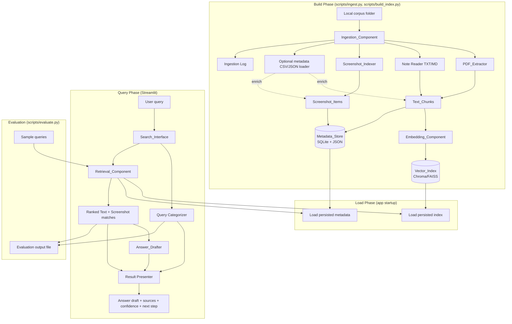

# Design Document

## Overview

The Internal Training Content Search Assistant is a low-cost, local-first retrieval prototype built with Python and Streamlit. It ingests a bounded corpus of mixed training content (PDFs, TXT/Markdown notes, and screenshots), builds a persistent local search index using sentence-transformers embeddings and a FAISS/Chroma vector store, and presents source-backed answers through a simple search interface.

The system is intentionally scoped as a **retrieval prototype**, not a general chatbot. Every drafted answer is grounded strictly in retrieved corpus content, with a qualitative confidence indicator and a suggested next step. Answer drafting is optional and pluggable: when a local model (Ollama) or an external API is unavailable, the system falls back to a deterministic grounded-extractive draft assembled directly from retrieved chunks.

### Design Goals

1. **Local-first, zero paid dependency** — All core functionality (ingestion, embedding, indexing, retrieval) runs on a standard CPU laptop with no GPU and no paid cloud service (Req 6, 12).
2. **Persistence and reuse** — Indexes and metadata are persisted so restarts do not require re-ingestion or re-embedding (Req 5.3, 6.4).
3. **Resilient ingestion** — A single bad file never aborts the pipeline; skips and errors are logged and reported (Req 1.3, 1.4, 2.4).
4. **Honest confidence** — Low-confidence results are surfaced explicitly rather than masked (Req 9.3, 11).
5. **Reproducible evaluation** — A scripted evaluation harness runs ≥20 sample queries and writes structured outputs (Req 13).

### Research Notes and Key Decisions

The following decisions were made based on the requirements, the existing project scaffolding, and the provided dataset pack.

- **Embedding model: `sentence-transformers/all-MiniLM-L6-v2`.** This is a 384-dimensional, ~80MB CPU-friendly model that is the de facto standard for local semantic search. It satisfies "local sentence-transformers model, no GPU, no paid cloud" (Req 6.1, 6.2). It is downloaded once and cached under `data/model/` (a folder already present in the scaffolding), enabling offline reuse.
- **Vector store: Chroma (default), FAISS-compatible design.** The scaffolding already contains both `data/chroma_store/` and `data/vector_store/` directories. Chroma is chosen as the default because it provides built-in persistence, metadata filtering, and stable IDs with minimal code, satisfying the persistence requirement (Req 6.3, 6.4) directly. The `VectorIndex` interface (below) is abstract so a FAISS + sidecar-metadata backend can be swapped in without touching the retrieval layer. The requirements permit "FAISS or Chroma," so this satisfies the spec while leaving room to switch.
- **Metadata store: SQLite.** The requirements permit SQLite, CSV, or JSON (Req 5.2). SQLite is chosen because it gives transactional persistence, indexed lookups by `item_id`, and clean joins between chunks and screenshots, while remaining a single local file (`data/metadata.db`) with no server. A JSON export is also written for human inspection and portability.
- **PDF extraction: PyMuPDF (`fitz`).** Already listed in the sibling project's dependencies and available on CPU. It exposes per-page text extraction, which directly satisfies the page-reference requirement (Req 2.1, 2.3).
- **OCR: optional via `pytesseract`, disabled by default.** The requirements make OCR conditional ("WHERE OCR is enabled and available") and establish manual metadata as the primary path (Req 4.2, 4.3, 4.4). Because Tesseract requires a system binary that may not be installed, OCR is feature-flagged off by default; the screenshot indexer degrades gracefully to filename + manual metadata.
- **Answer drafting: pluggable with grounded-extractive fallback.** A strategy interface (`AnswerDrafter`) supports an Ollama backend, an OpenAI-API backend, and a default `ExtractiveDrafter`. Req 12.3 mandates the fallback; the default path requires no external model at all, so the prototype works out of the box.
- **Query categorization: rule-based keyword/embedding classifier over 5 fixed categories.** Req 8.1 fixes the category set (onboarding, SOP lookup, screenshot lookup, policy reference, troubleshooting support) and requires exactly one label. A lightweight deterministic classifier (keyword rules with an embedding-similarity tie-breaker against category prototype phrases) keeps this local and explainable. Note this category set differs from the dataset pack's `routes`; the pack's routes are used only as evaluation hints, not as the query categories.

---

## Architecture

The system has three runtime phases: **Build (offline)**, **Load (startup)**, and **Query (interactive)**. Build is executed by ingestion/indexing scripts; Load and Query happen inside the Streamlit app.



### Layering

The design enforces separation between I/O, indexing, and presentation so the retrieval logic can be tested in isolation:

- **Extraction layer** (`ingestion/`): file reading, PDF/text extraction, chunking, screenshot indexing. Pure transformations over file bytes → chunk/item objects.
- **Index layer** (`index/`): embeddings + vector store + metadata store. Wraps external libraries behind narrow interfaces.
- **Retrieval layer** (`retrieval/`): query embedding, similarity search, thresholding, categorization, answer drafting. Contains the core logic and is the primary target of property-based tests (uses an in-memory fake index in tests to stay fast and deterministic).
- **Presentation layer** (`app.py`): Streamlit UI, result rendering, confidence and next-step display.

---

## Components and Interfaces

### Project Structure

The design extends the existing `ai-training-assistant/` scaffolding (which already contains `data/`, `src/`, the dataset pack, and `.env`):

```
ai-training-assistant/
├── app.py                     # Streamlit Search_Interface (entry point)
├── config.py                  # Central config (thresholds, paths, chunk size, model name)
├── requirements.txt           # Streamlit + sentence-transformers + chromadb + pymupdf + ...
├── src/
│   ├── ingestion/
│   │   ├── ingest.py          # Ingestion_Component orchestrator
│   │   ├── pdf_extractor.py   # PDF_Extractor
│   │   ├── note_reader.py     # TXT/MD reader
│   │   ├── screenshot_indexer.py  # Screenshot_Indexer
│   │   ├── chunker.py         # Chunking utility (shared by PDF + notes)
│   │   └── metadata_loader.py # Optional CSV/JSON metadata loader
│   ├── index/
│   │   ├── embedder.py        # Embedding_Component (sentence-transformers)
│   │   ├── vector_index.py    # Vector_Index interface + Chroma impl
│   │   └── metadata_store.py  # Metadata_Store (SQLite + JSON export)
│   ├── retrieval/
│   │   ├── retriever.py       # Retrieval_Component (search + threshold)
│   │   ├── categorizer.py     # Query_Category classifier
│   │   ├── drafter.py         # Answer_Drafter (Extractive + Ollama + OpenAI)
│   │   └── confidence.py      # Confidence_Indicator + next-step logic
│   └── models.py              # Dataclasses: TextChunk, ScreenshotItem, SearchResult, ...
├── scripts/
│   ├── build.py               # Runs full ingestion + indexing pipeline (CLI)
│   └── evaluate.py            # Evaluation_Component harness (CLI)
├── data/
│   ├── documents/corpus/      # Source content (existing)
│   ├── chroma_store/          # Persisted Chroma vector index (existing)
│   ├── metadata.db            # SQLite Metadata_Store
│   ├── metadata.json          # Human-readable metadata export
│   ├── logs/ingestion.log     # Ingestion log (existing logs/ dir)
│   └── model/                 # Cached embedding model (existing)
└── tests/
    ├── test_chunker.py
    ├── test_retriever.py
    ├── test_categorizer.py
    ├── test_drafter.py
    ├── test_metadata_roundtrip.py
    └── conftest.py            # Generators / fixtures
```

### Interface Definitions

Interfaces are expressed as Python type signatures (Protocols / dataclasses).

#### Ingestion_Component

```python
class IngestionComponent:
    def ingest_folder(self, folder_path: str) -> IngestionResult:
        """Walk folder + subfolders, dispatch by extension, load optional
        metadata, and assemble chunks and screenshot items.
        Req 1.1, 1.2, 1.5."""

@dataclass
class IngestionResult:
    text_chunks: list[TextChunk]
    screenshot_items: list[ScreenshotItem]
    ingested_doc_count: int       # Req 1.5
    ingested_screenshot_count: int
    skipped: list[SkippedEntry]   # unsupported ext + parse failures (Req 1.3, 1.4)
```

`ingest_folder` NEVER raises on a single-file failure; it records a `SkippedEntry(name, reason)` and continues (Req 1.4).

#### PDF_Extractor

```python
class PdfExtractor:
    def extract(self, path: str) -> list[PageText]:
        """Return per-page text using PyMuPDF. Req 2.1."""

@dataclass
class PageText:
    page_number: int   # 1-based
    text: str
```

If a PDF yields no extractable text on any page, the extractor returns an empty list and the ingestion orchestrator logs "no extractable text" and produces zero chunks for that file (Req 2.4).

#### Chunker (shared by PDF and notes)

```python
class Chunker:
    def __init__(self, max_chunk_size: int, overlap: int = 0): ...
    def chunk(self, text: str) -> list[str]:
        """Split text into segments each <= max_chunk_size characters.
        Req 2.2, 3.1."""
```

Chunking is size-bounded and splits on paragraph/sentence boundaries when possible, hard-splitting only when a single unit exceeds `max_chunk_size`.

#### Screenshot_Indexer

```python
class ScreenshotIndexer:
    def __init__(self, ocr_enabled: bool = False): ...
    def index(self, path: str, manual_meta: ScreenshotMeta | None) -> ScreenshotItem:
        """Record file name + path always. Add OCR text if enabled+available;
        add topic/description from manual_meta if provided. Req 4.1-4.4."""
```

#### Metadata_Loader

```python
class MetadataLoader:
    def load(self, folder_path: str) -> dict[str, ItemMeta]:
        """Find optional metadata.csv / metadata.json in folder; return a map
        keyed by source file name. Returns {} if absent. Req 1.2."""
```

#### Embedding_Component

```python
class Embedder:
    def __init__(self, model_name: str, cache_dir: str): ...
    def embed(self, texts: list[str]) -> list[list[float]]:
        """Batch-embed with sentence-transformers on CPU. Req 6.1, 6.2."""
    def embed_query(self, query: str) -> list[float]:
        """Embed a single query with the SAME model. Req 7.1."""
```

#### Vector_Index (abstract; Chroma default)

```python
class VectorIndex(Protocol):
    def upsert(self, entries: list[IndexEntry]) -> None: ...      # Req 6.3
    def search(self, query_vec: list[float], top_k: int) -> list[Match]: ...  # Req 7.2
    def persist(self) -> None: ...                                # Req 6.3
    @classmethod
    def load(cls, path: str) -> "VectorIndex": ...                # Req 6.4

@dataclass
class IndexEntry:
    chunk_id: str
    vector: list[float]
    metadata: dict   # references TextChunk

@dataclass
class Match:
    chunk_id: str
    score: float     # normalized similarity in [0, 1], higher = more similar
```

Cosine similarity is normalized to `[0, 1]` so thresholds (Req 7.5, 11.1) are stable across backends.

#### Metadata_Store

```python
class MetadataStore:
    def save_chunks(self, chunks: list[TextChunk]) -> None: ...        # Req 5.1
    def save_screenshots(self, items: list[ScreenshotItem]) -> None: ... # Req 5.1
    def persist(self, db_path: str, json_path: str) -> None: ...       # Req 5.2
    @classmethod
    def load(cls, db_path: str) -> "MetadataStore": ...                # Req 5.3
    def get_chunk(self, chunk_id: str) -> TextChunk | None: ...
    def get_screenshot(self, item_id: str) -> ScreenshotItem | None: ...
```

#### Retrieval_Component

```python
class Retriever:
    def __init__(self, index: VectorIndex, store: MetadataStore,
                 embedder: Embedder, config: RetrievalConfig): ...
    def retrieve(self, query: str) -> RetrievalOutcome:
        """Embed query, search index, apply threshold, rank text + screenshot
        matches, attach category + confidence. Req 7.1-7.5, 8.1."""

@dataclass
class RetrievalConfig:
    top_k: int                    # Req 7.2
    min_similarity: float         # Req 7.5 no-match threshold
    medium_confidence_threshold: float  # Req 11.1
    high_confidence_threshold: float

@dataclass
class RetrievalOutcome:
    query: str
    category: QueryCategory       # Req 8.1
    text_matches: list[TextMatch]      # ranked, above threshold
    screenshot_matches: list[ScreenshotMatch]
    confidence: Confidence        # High | Medium | Low (Req 10.3, 11.1)
    no_match: bool                # Req 7.5
```

#### Query Categorizer

```python
class Categorizer:
    CATEGORIES = ("onboarding", "sop_lookup", "screenshot_lookup",
                  "policy_reference", "troubleshooting_support")
    def categorize(self, query: str) -> QueryCategory:
        """Return exactly one category. Req 8.1."""
```

#### Answer_Drafter (strategy)

```python
class AnswerDrafter(Protocol):
    def draft(self, outcome: RetrievalOutcome) -> AnswerDraft: ...

class ExtractiveDrafter:      # default, no external deps (Req 12.3 fallback)
class OllamaDrafter:          # optional local LLM
class OpenAIDrafter:          # optional external API

@dataclass
class AnswerDraft:
    text: str                 # <= 6 lines, grounded only in retrieved items (Req 9.1)
    sources: list[SourceRef]  # Req 9.2
    low_confidence_note: bool # Req 11.2
```

`OllamaDrafter` / `OpenAIDrafter` catch connection/availability errors and the caller falls back to `ExtractiveDrafter` (Req 12.3). All drafters produce text derived only from `outcome` content; none introduce outside facts. When `outcome.no_match` is true, the drafter returns a "no supporting content found" statement with no guidance (Req 9.3).

#### Search_Interface (Streamlit `app.py`)

Responsibilities: capture query input, reject empty queries with a prompt (Req 7.4), invoke retrieval + drafting, and render results — text references (title, page/section, source file, excerpt — Req 10.1), screenshot matches (preview or filename, topic tag, metadata/OCR text — Req 10.2), category (Req 8.2), confidence indicator (Req 10.3), and suggested next step (Req 10.4, 11.1).

#### Evaluation_Component (`scripts/evaluate.py`)

Loads ≥20 predefined queries (from a bundled `sample_queries.csv`, seeded from the dataset pack's `evaluation_set.csv`), runs each through the retriever, and writes per-query text references, screenshot matches, category, and confidence to a local output file (`data/evaluation_output.csv` + a Markdown summary). Req 13.1–13.3.

---

## Data Models

```python
from dataclasses import dataclass, field
from enum import Enum

class DocType(str, Enum):
    PDF = "pdf"
    NOTE = "note"          # txt / md
    SCREENSHOT = "screenshot"

class QueryCategory(str, Enum):
    ONBOARDING = "onboarding"
    SOP_LOOKUP = "sop_lookup"
    SCREENSHOT_LOOKUP = "screenshot_lookup"
    POLICY_REFERENCE = "policy_reference"
    TROUBLESHOOTING = "troubleshooting_support"

class Confidence(str, Enum):
    HIGH = "High"
    MEDIUM = "Medium"
    LOW = "Low"

@dataclass(frozen=True)
class TextChunk:
    chunk_id: str            # stable id: f"{source_file}::{page_or_section}::{ordinal}"
    text: str
    source_file: str         # Req 2.3, 3.2, 5.1
    doc_type: DocType        # Req 5.1
    page_reference: int | None      # Req 2.1, 2.3 (PDF page)
    section_reference: str | None   # Req 3.2 (heading/section for notes)
    topic_tag: str | None    # Req 5.1 (from metadata if available)
    title: str | None        # display title (Req 10.1)

@dataclass(frozen=True)
class ScreenshotItem:
    item_id: str             # stable id from file path
    file_name: str           # Req 4.1, 5.1
    file_path: str           # Req 4.1
    topic_tag: str | None    # Req 4.3, 5.1
    description: str | None  # Req 4.3
    ocr_text: str | None     # Req 4.2 (None when OCR disabled/unavailable)
    doc_type: DocType = DocType.SCREENSHOT

@dataclass
class TextMatch:
    chunk: TextChunk
    score: float             # normalized [0,1]

@dataclass
class ScreenshotMatch:
    item: ScreenshotItem
    score: float

@dataclass(frozen=True)
class SourceRef:
    source_file: str
    reference: str | None    # page or section
    excerpt: str

@dataclass(frozen=True)
class SkippedEntry:
    name: str
    reason: str              # "unsupported_extension" | descriptive parse error

@dataclass(frozen=True)
class ItemMeta:
    topic_tag: str | None
    description: str | None
    title: str | None
```

### Metadata Store Schema (SQLite)

```sql
CREATE TABLE chunks (
    chunk_id TEXT PRIMARY KEY,
    text TEXT NOT NULL,
    source_file TEXT NOT NULL,
    doc_type TEXT NOT NULL,
    page_reference INTEGER,
    section_reference TEXT,
    topic_tag TEXT,
    title TEXT
);
CREATE TABLE screenshots (
    item_id TEXT PRIMARY KEY,
    file_name TEXT NOT NULL,
    file_path TEXT NOT NULL,
    topic_tag TEXT,
    description TEXT,
    ocr_text TEXT
);
CREATE INDEX idx_chunks_source ON chunks(source_file);
```

### Configuration Defaults (`config.py`)

| Setting | Default | Requirement |
|---|---|---|
| `EMBEDDING_MODEL` | `all-MiniLM-L6-v2` | 6.1 |
| `MAX_CHUNK_SIZE` | 800 chars | 2.2, 3.1 |
| `CHUNK_OVERLAP` | 100 chars | 2.2 |
| `TOP_K` | 5 | 7.2 |
| `MIN_SIMILARITY` | 0.30 | 7.5 |
| `MEDIUM_CONFIDENCE_THRESHOLD` | 0.45 | 11.1 |
| `HIGH_CONFIDENCE_THRESHOLD` | 0.65 | 10.3 |
| `OCR_ENABLED` | `False` | 4.4 |
| `ANSWER_MODEL` | `extractive` | 12.3 |
| `ANSWER_MAX_LINES` | 6 | 9.1 |

---

## Correctness Properties

*A property is a characteristic or behavior that should hold true across all valid executions of a system — essentially, a formal statement about what the system should do. Properties serve as the bridge between human-readable specifications and machine-verifiable correctness guarantees.*

The properties below were derived from the acceptance-criteria prework. Testable criteria were consolidated to remove redundancy (e.g., the two chunk-size criteria became one property; the three persistence criteria became one round-trip property; the confidence/next-step/low-confidence criteria became one mapping property). Criteria that are environment constraints (6.2, 12.1, 12.2), external-library or file-I/O behavior (2.1, 4.2, 6.1, 6.4, 13.3), or UI rendering (8.2, 10.1, 10.2) are covered by smoke/example/integration tests in the Testing Strategy rather than by properties.

### Property 1: Ingestion partitions input files

*For any* folder tree containing a mix of supported files (PDF, TXT, MD, PNG, JPG, JPEG) and unsupported files, every supported text file contributes to the ingested-document count, every supported screenshot contributes to the ingested-screenshot count, every unsupported file appears in the skipped list with reason `unsupported_extension`, and `ingested_doc_count + ingested_screenshot_count + len(skipped)` equals the total number of files walked.

**Validates: Requirements 1.1, 1.3, 1.5**

### Property 2: Ingestion is resilient to per-file failures

*For any* set of supported files in which an arbitrary subset fails to parse, ingestion completes without raising, every failing file appears in the skipped list with a descriptive reason, and every successfully-parsed file still produces its output items.

**Validates: Requirements 1.4**

### Property 3: Chunk size is bounded

*For any* extracted text and any configured maximum chunk size N > 0, every produced Text_Chunk has length ≤ N, and the concatenation of chunks (ignoring overlap) covers the non-whitespace content of the original text.

**Validates: Requirements 2.2, 3.1**

### Property 4: Every chunk carries provenance

*For any* Text_Chunk produced by ingestion, the chunk has a non-empty `source_file`, and it has a `page_reference` when it originates from a PDF or a `section_reference` when a heading/section is available for a note.

**Validates: Requirements 2.3, 3.2**

### Property 5: Screenshot indexing preserves identity and applies metadata

*For any* screenshot image, the produced Screenshot_Item records its `file_name` and `file_path`; when manual metadata is provided the item carries that `topic_tag` and `description`; and when OCR is disabled the item's `ocr_text` is `None` while the item is still indexed by file name and any manual metadata.

**Validates: Requirements 1.2, 4.1, 4.3, 4.4**

### Property 6: Metadata store round-trip

*For any* set of Text_Chunks and Screenshot_Items, persisting them to the Metadata_Store and then loading a fresh store from disk yields items equal to the originals across all recorded fields (topic tag, document type, source file, page/section reference).

**Validates: Requirements 5.1, 5.2, 5.3**

### Property 7: Retrieval ranking, limit, and reference consistency

*For any* set of indexed chunks/screenshots and any non-empty query, the returned text matches and screenshot matches are each ordered by descending similarity score, each result set contains at most `top_k` items, and every returned match id resolves to an actual stored chunk or screenshot.

**Validates: Requirements 6.3, 7.1, 7.2, 7.3**

### Property 8: Below-threshold retrieval yields a no-match result

*For any* query for which no indexed item has a normalized similarity ≥ `min_similarity`, the retrieval outcome has empty text and screenshot match sets and its `no_match` flag is true.

**Validates: Requirements 7.5**

### Property 9: Query categorization is total and single-valued

*For any* query string, the categorizer returns exactly one Query_Category, and that value is a member of the fixed set {onboarding, sop_lookup, screenshot_lookup, policy_reference, troubleshooting_support}.

**Validates: Requirements 8.1**

### Property 10: Empty queries are rejected without retrieval

*For any* query string composed entirely of whitespace (including the empty string), the Search_Interface returns an empty-query prompt and does not invoke the Retrieval_Component.

**Validates: Requirements 7.4**

### Property 11: Confidence and next-step mapping

*For any* top similarity score s, the Confidence_Indicator is exactly one of {High, Medium, Low}, is monotonic in s with respect to the configured thresholds (High when s ≥ high threshold, Medium when medium ≤ s < high, Low when s < medium), the suggested next step is a member of {use the source directly, review the original file, escalate to the operations lead if unclear}, and whenever the confidence is Low the suggested next step is "escalate to the operations lead if unclear".

**Validates: Requirements 10.3, 10.4, 11.1**

### Property 12: Answer drafts are grounded

*For any* retrieval outcome, the extractive answer draft is at most 6 lines; when the outcome has matches the draft's source references are non-empty and each references an actual retrieved item, and the drafted text content is drawn only from retrieved items; when the outcome is a no-match the draft states that no supporting content was found and contains no drafted guidance and no sources; and whenever the confidence is Low the draft's `low_confidence_note` is true.

**Validates: Requirements 9.1, 9.2, 9.3, 11.2**

### Property 13: Answer drafting falls back to grounded extraction

*For any* retrieval outcome, when the configured primary drafter (Ollama or OpenAI) is unavailable or raises, the Answer_Drafter still returns a valid grounded draft produced by the extractive fallback rather than propagating an error.

**Validates: Requirements 12.3**

### Property 14: Evaluation output is complete

*For any* list of sample queries, running the Evaluation_Component produces exactly one output record per query, and each record contains the retrieved text references, the retrieved screenshot matches, the assigned Query_Category, and the Confidence_Indicator.

**Validates: Requirements 13.2**

---

## Error Handling

The system favors graceful degradation over aborting, because a single malformed file or an unavailable optional model must not break the prototype.

### Ingestion Errors

| Condition | Handling | Requirement |
|---|---|---|
| Unsupported file extension | Skip file, add `SkippedEntry(name, "unsupported_extension")`, continue | 1.3 |
| Supported file fails to open/parse | Catch exception, add `SkippedEntry(name, str(error))` to log, continue with next file | 1.4 |
| PDF has no extractable text | Log "no extractable text", produce zero chunks for that file (not an error) | 2.4 |
| Optional metadata file absent | Proceed with empty metadata map (not an error) | 1.2 |
| Optional metadata file malformed | Log a warning, proceed without metadata enrichment | 1.2 |

Ingestion errors are collected in `data/logs/ingestion.log` and surfaced in the final `IngestionResult.skipped`. The orchestrator wraps each per-file operation in a try/except so one failure never aborts the run.

### Index / Embedding Errors

| Condition | Handling |
|---|---|
| Embedding model missing from cache and offline | Fail fast at build time with a clear message: run `scripts/build.py` while online once to cache the model under `data/model/`. |
| Vector store directory missing at startup | App reports "index not built" and directs the user to run `scripts/build.py`; does not crash. |
| Corrupt/partial persisted index | Log error and instruct rebuild; do not silently return wrong results. |

### Query-Time Errors

| Condition | Handling | Requirement |
|---|---|---|
| Empty/whitespace query | Show prompt, skip retrieval | 7.4 |
| No matches above threshold | Return `no_match` outcome; drafter emits "no supporting content found" | 7.5, 9.3 |
| Primary answer model (Ollama/OpenAI) unavailable | Catch connection/timeout error, fall back to `ExtractiveDrafter` | 12.3 |
| OCR requested but Tesseract binary absent | Log once, treat OCR as disabled, index by filename + manual metadata | 4.4 |

### Streamlit Session Errors

Index and metadata are loaded once and cached with `@st.cache_resource` so repeated queries reuse the same in-memory objects. Load failures surface a friendly error banner rather than a stack trace.

---

## Testing Strategy

The strategy combines property-based tests for input-varying logic with example, integration, and smoke tests for external dependencies and UI. The retrieval, chunking, categorization, confidence, and drafting logic are tested in isolation using an **in-memory fake `VectorIndex` and a small deterministic fake `Embedder`**, so property tests run fast on CPU without loading the real model or touching disk.

### Property-Based Tests

- **Library**: [`hypothesis`](https://hypothesis.readthedocs.io/) for Python. We will NOT implement property-based testing from scratch.
- **Iterations**: each property test is configured for a minimum of 100 examples (`@settings(max_examples=100)`).
- **Tagging**: each property test is tagged with a comment in the format `# Feature: internal-training-content-search, Property {number}: {property_text}`.
- **Coverage**: one property-based test per Correctness Property (Properties 1–14).

Custom Hypothesis strategies (in `tests/conftest.py`) generate:
- random folder trees with mixed supported/unsupported extensions (Property 1, 2),
- arbitrary text bodies including empty, whitespace, unicode, and very long strings (Property 3, 10),
- `TextChunk` / `ScreenshotItem` collections with optional metadata (Property 4, 5, 6),
- fake index entries with controllable scores (Property 7, 8, 11),
- arbitrary query strings including whitespace-only (Property 9, 10),
- `RetrievalOutcome`s spanning match / no-match and High/Medium/Low confidence (Property 12, 13),
- random sample-query lists driving a fake retriever (Property 14).

Edge cases (empty text, whitespace-only queries, unicode, oversize single tokens, zero matches, all-below-threshold scores) are covered by the generators rather than by separate example tests.

### Example-Based Unit Tests

- PDF page-number association using 2–3 small fixture PDFs (Req 2.1) and the empty-PDF path (Req 2.4).
- Embedding shape/determinism against the real model: one test asserting a 384-dim vector and stable output for identical input (Req 6.1).
- Render-helper completeness: pure functions that build the display payload for a text reference (title, page/section, source file, excerpt — Req 10.1) and a screenshot match (preview/filename, topic tag, metadata/OCR text — Req 10.2), asserting all required fields are present.
- Category label appears in the rendered result payload (Req 8.2).

### Integration Tests

- End-to-end small-corpus build → persist → reload → query, asserting identical top-k results before and after reload (Req 6.4).
- Optional OCR path against one fixture image, skipped automatically when the Tesseract binary is not installed (Req 4.2).
- Evaluation harness end-to-end: run the bundled sample queries and assert an output file is written with the expected number of rows (Req 13.3).

### Smoke Tests

- CPU-only execution: build and query run with no GPU present (Req 6.2, 12.1).
- Local-only default config: default `ANSWER_MODEL=extractive` and no network calls required for core retrieval (Req 12.2).
- Sample-query set contains at least 20 queries (Req 13.1).

### Test Execution Notes

- Run the suite once (not in watch mode): `pytest -q` (or `pytest tests/ -q`). Do not use watch mode in automated runs.
- Property tests use `@settings(max_examples=100, deadline=None)` to accommodate CPU variance without flakiness.
- Real-model and OCR tests are marked (`@pytest.mark.slow`, `@pytest.mark.ocr`) and skip gracefully when resources are unavailable, keeping the default run fast and offline-friendly.
